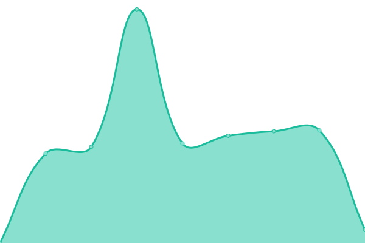

# [📈 Live Status](https://status.zenlabs.gg): <!--live status--> **🟧 Partial outage**

This repository contains the open-source uptime monitor and status page for [Upptime](https://upptime.js.org), powered by [Upptime](https://github.com/upptime/upptime).

With [Upptime](https://upptime.js.org), you can get your own unlimited and free uptime monitor and status page, powered entirely by a GitHub repository. We use [Issues](https://github.com/upptime/upptime/issues) as incident reports, [Actions](https://github.com/zenlbs/upptime/actions) as uptime monitors, and [Pages](https://status.zenlabs.gg) for the status page.

<!--start: status pages-->
<!-- This summary is generated by Upptime (https://github.com/upptime/upptime) -->
<!-- Do not edit this manually, your changes will be overwritten -->
<!-- prettier-ignore -->
| URL | Status | History | Response Time | Uptime |
| --- | ------ | ------- | ------------- | ------ |
|  [WOM API Production](https://wom-api.goldenadgroup.vn/healthz) | 🟩 Up | [wom-api-production.yml](https://github.com/zenlbs/upptime/commits/HEAD/history/wom-api-production.yml) | 

 1413ms
     
 | 

<a href="https://status.zenlabs.gg/history/wom-api-production">100.00%</a>
    

|  [HRIS API Production](https://hris-api.goldenadgroup.vn/healthz) | 🟩 Up | [hris-api-production.yml](https://github.com/zenlbs/upptime/commits/HEAD/history/hris-api-production.yml) | 

 1514ms
     
 | 

<a href="https://status.zenlabs.gg/history/hris-api-production">100.00%</a>
    

|  [SNS API Production](https://sns-tools.fly.dev/healthz) | 🟩 Up | [sns-api-production.yml](https://github.com/zenlbs/upptime/commits/HEAD/history/sns-api-production.yml) | 

 2324ms
     
 | 

<a href="https://status.zenlabs.gg/history/sns-api-production">100.00%</a>
    

|  [Hardtech API Productglion](https://hardtech-api.zenlabs.gg/healthz) | 🟥 Down | [hardtech-api-productglion.yml](https://github.com/zenlbs/upptime/commits/HEAD/history/hardtech-api-productglion.yml) | 

 882ms
     
 | 

<a href="https://status.zenlabs.gg/history/hardtech-api-productglion">0.00%</a>
    

<!--end: status pages-->

[**Visit our status website →**](https://status.zenlabs.gg)

## 📄 License

- Powered by: [Upptime](https://github.com/upptime/upptime)
- Code: [MIT](./LICENSE) © [Anand Chowdhary](https://anandchowdhary.com), supported by [Pabio](https://pabio.com)
- Data in the `./history` directory: [Open Database License](https://opendatacommons.org/licenses/odbl/1-0/)
